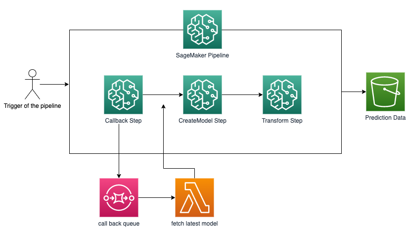

## Create a SageMaker Pipeline utilising a custom callback step

This repository provides a demonstration of how to use the 
[Callback Step](https://docs.aws.amazon.com/sagemaker/latest/dg/build-and-manage-steps.html#step-type-callback) 
of SageMaker Pipelines into your own pipelines to easily integrate virtually any other AWS service. 
The Particular example used here is to use this step to call a Lambda function that will read and return 
the latest model from a model registry to then perform a batch transformation. 

The solution that this repository implements can be seen below:

## Get started

Open the notebook [batch_transform_with_callback](batch_transform_with_callback.ipynb)
and follow the instructions from there. 

## Security

See [CONTRIBUTING](CONTRIBUTING.md#security-issue-notifications) for more information.

## License

This library is licensed under the MIT-0 License. See the LICENSE file.

